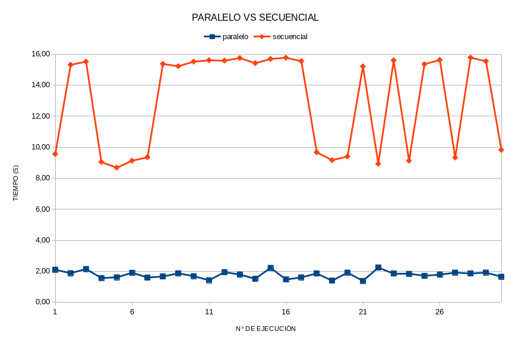

# Paralelizacion con OpenMPI

El programa se encarga de procesar un archivo de imagen en formato `GeoTIFF` y aplicar un filtro a cada banda de la imagen. El filtro utilizado es un kernel lineal que resalta los bordes de la imagen. Se hace uso de la biblioteca **GDAL** para leer y escribir archivos de imagen raster y de la biblioteca **OpenMP** para paralelizar el procesamiento.

> [!IMPORTANT]
> Puede encontrar las imagenes `GeoTIFF` utilizadas para las pruebas en el siguiente [link](https://drive.google.com/drive/folders/1em4_plY-dYmwc4ENqZqVOczFuFjKcWNJ?usp=drive_link).

### Autores:
- **Bottini, Franco Nicolas**

### ¿ Como compilar ?

```bash
$ git clone https://github.com/francobottini99/PARALLELPROGRAM-2023.git
$ cd PARALLELPROGRAM-2023
$ cmake .
$ make
```

El programa está diseñado para admitir tanto procesamiento en serie como paralelo, y se puede compilar en cualquiera de los dos modos utilizando una directiva de compilación condicional. Esta directiva es **PARALLEL_PROCESSING** y se puede establecer en el archivo `commun.h`. En este archivo también existen otras directivas que permiten modificar otros aspectos de la compilación del programa.

Como salida obtendremos un ejecutable ubicado en la carpeta `/bin`: `lab4`.

> [!NOTE]
> Para compilar el proyecto es necesario tener instalado la librería de **GDAL** en el equipo.

### ¿ Como ejecutar ?

Una vez compilado el programa, se puede ejecutar de la siguiente manera:

```bash
$ ./bin/lab4 <input_file> <output_file>
```

La función main toma dos argumentos de línea de comandos: la ruta de entrada del archivo GeoTIFF y la ruta de salida del archivo procesado. 

### ¿ Como funciona ?

Como se menciono al comienzo, el programa en cuestión es un procesador de imágenes que aplica un filtro convolucional a un archivo de imagen en formato TIFF. El filtro utilizado es conocido como *edge filter*, y se encarga de resaltar los bordes de una imagen. El programa recibe como argumentos la ruta donde se encuentra el archivo de entrada (imagen original en formato TIFF) y la ruta donde generar el archivo de salida (imagen filtrada en formato TIFF). A partir de esto, se generan dos *datasets* de trabajo, uno para el archivo de entrada y otro para el archivo de salida. Con estos datos, dependiendo del modo de compilación, se ejecuta el procesamiento en serie o paralelo. El procesamiento se divide en tres tareas principales: lectura de la imagen, filtrado de la imagen y escritura de la imagen. Cada una de estas tareas se ejecuta para cada una de las bandas de la imagen (rojo, verde y azul). En caso del procesamiento en serie, se ejecutan las tareas de forma secuencial, mientras que en el procesamiento paralelo se ejecutan de forma concurrente. Una vez finalizado el procesamiento, se libera la memoria utilizada y se cierran los *datasets*. Con esto obtenemos el archivo de salida con la imagen filtrada y finaliza la ejecución del programa.

### Pruebas de rendimiento

Para realizar las pruebas de rendimiento se utilizo un equipo con las siguientes características:

- Procesador: 12th Gen Intel(R) Core(TM) i7-12700H

- Memoria: 16 GB

- GPU: NVIDIA GeForce RTX 3050

- Sistema Operativo: Pop!_OS 22.04 LTS

- Compilador: gcc 11.3.0

- GDAL: 3.7.0

Se utilizo una imagen de 10980x10980 pixeles, con un tamaño de 345 MB. Se realizaron 30 ejecuciones de cada modo de procesamiento sobre la misma imagen y se calculo el tiempo promedio de ejecución. Los resultados obtenidos fueron los siguientes:

| N° | Serie (s) | Paralelo (s) | N° | Serie (s) | Paralelo (s) |
| -- | --------- | ------------ | -- | --------- | ------------ |
| 1 | 9,56 | 2,10 | 16 | 15,77 | 1,46 |
| 2 | 15,31 | 1,87 | 17 | 15,55 | 1,61 |
| 3 | 15,32 | 2,14 | 18 | 9,67 | 1,86 |
| 4 | 9,04 | 1,56 | 19 | 9,16 | 1,39 |
| 5 | 8,68 | 1,61 | 20 | 9,40 | 1,91 |
| 6 | 9,13 | 1,90 | 21 | 15,21 | 1,38 |
| 7 | 9,35 | 1,59 | 22 | 8,93 | 2,24 |
| 8 | 15,37 | 1,66 | 23 | 15,60 | 1,85 |
| 9 | 15,22 | 1,87 | 24 | 9,13 | 1,83 |
| 10 | 15,52 | 1,68 | 25 | 15,35 | 1,71 |
| 11 | 15,61 | 1,42 | 26 | 15,63 | 1,78 |
| 12 | 15,58 | 1,94 | 27 | 9,33 | 1,91 |
| 13 | 15,75 | 1,79 | 28 | 15,78 | 1,85 |
| 14 | 15,42 | 1,51 | 29 | 15,54 | 1,92 |
| 15 | 15,69 | 2,22 | 30 | 9,82 | 1,65 |

| | Serie (s) | Paralelo (s) | | Serie (s) | Paralelo (s) |
| -------- | --------- | ------------ | -------- | --------- | ------------ |
| Promedio | 13,02 | 1,77 | Total | 390,61 | 53,21 |

### Conclusiones

Con los datos obtenidos podemos concluir que en el hardware donde se realizaron las pruebas, el algoritmo de ejecución en paralelo es, en promedio, un **634 %** mas rápido que el secuencial.

<p align="center">
  
</p>

<p align="center">
  
</p>